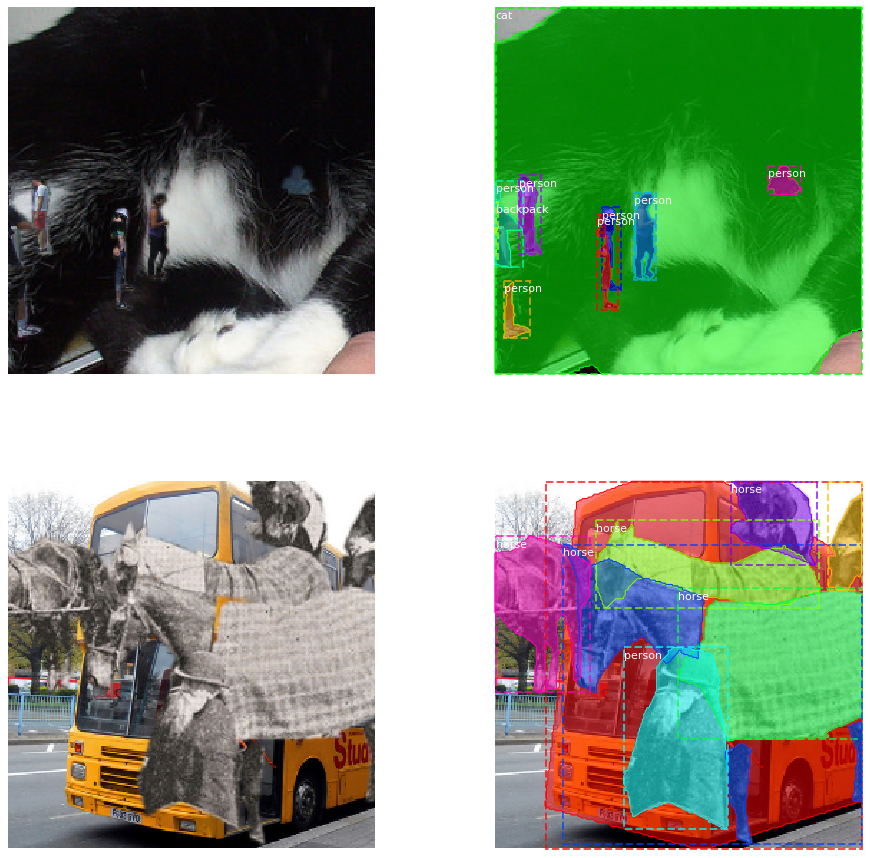

# Copy-Paste
Unofficial implementation of the copy-paste augmentation from [Simple Copy-Paste is a Strong Data Augmentation Method for Instance Segmentation](https://arxiv.org/abs/2012.07177v1).

The augmentation function is built to integrate easily with albumentations. An example for creating a compatible torchvision dataset is given for COCO. Core functionality for image, masks, and bounding boxes is finished; keypoints are not yet supported. In general, you can use the CopyPaste augmentation just as you would any other albumentations augmentation function. There are a few usage limitations of note.

<figure>
  </img>
</figure>

## Usage Notes

1. BboxParams cannot have label_fields. To attach class labels to a bounding box, directly append it to the bounding box coordinates. (I.e. (x1, y1, x2, y2, class_id)).
2. Bounding boxes passed to the CopyPaste augmentation must also include the index of the corresponding mask in the 'masks' list. (I.e. the bounding box looks like (x1, y1, x2, y2, class_id, mask_index)). An example is given for COCO.
3. The CopyPaste augmentation expects 6 keyword arguments instead of three:

```python
# typical albumentations transform
output = transforms(image=image, masks=masks, bboxes=bboxes)

# for the copy paste transform
output = transforms(
    image=image, masks=masks, bboxes=bboxes,
    paste_image=paste_image, paste_masks=paste_masks, paste_bboxes=paste_bboxes
  )
```

4. After pasting objects, the original bounding boxes may be occluded. To make things easier,
the original bounding boxes are just extracted from the updated masks.

## Integration with Torchvision datasets

The idea is to have a standard torchvision dataset that's decorated for copy-paste functionality.

The dataset class looks like:

```python
from copy_paste import copy_paste_class
from torch.utils.data import Dataset

@copy_paste_class
class SomeVisionDataset(Dataset):
    def __init__(self, *args):
        super(SomeVisionDataset, self).__init__(*args)

    def __len__(self):
        return length

    def load_example(self, idx):
        image_data_dict = load_some_data(idx)
        transformed_data_dict = self.transforms(**image_data_dict)
        return transformed_data_dict

```
The only difference from a regular torchvision dataset is the decorator and the ```load_example``` method
instead of ```__getitem__```.

To compose transforms with copy-paste augmentation:

```python
import albumentations as A
from albumentations.pytorch.transforms import ToTensorV2
from copy_paste import CopyPaste

transform = A.Compose([
      A.RandomScale(scale_limit=(-0.9, 1), p=1), #LargeScaleJitter from scale of 0.1 to 2
      A.PadIfNeeded(256, 256, border_mode=0), #constant 0 border
      A.RandomCrop(256, 256),
      A.HorizontalFlip(p=0.5),
      CopyPaste(blend=True, sigma=1, pct_objects_paste=0.5, p=1)
    ], bbox_params=A.BboxParams(format="coco")
)
```

**Note: bbox params are NOT optional!**
